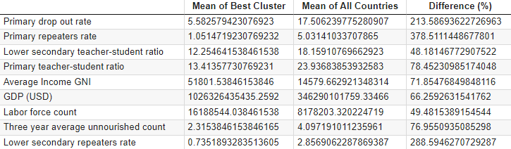

# Education Economic Factors In Different Countries

Group 1: [Adam Holsinger](https://github.com/AdamH18), [Adrianne Gelbach](https://github.com/adriannebunn), [Elo Ekor](https://github.com/eloekor), [Jackie Kim](https://github.com/kims32), [Kyuseok Nam](https://github.com/Kyuseok-nam), [Lauren Lui](https://github.com/laurenlui), [Shardul Joshi](https://github.com/joshardul)  
RPI Data Science - Fall 2021  
Professor Munasinghe

<br>

## Table of Contents
1. [Abstract](#abstract)
2. [Data management](#data-management)
    <ol type="a">
        <li><a href="#logical-collections">Logical collections</a></li>
        <li><a href="#physical-data-handling">Physical data handling</a></li>
        <li><a href="#security">Security</a></li>
        <li><a href="#interoperability-support">Interoperability support</a></li>
        <li><a href="#data-ownership">Data ownership</a></li>
        <li><a href="#metadata">Metadata</a></li>
        <li><a href="#persistence">Persistence</a></li>
        <li><a href="#discovery">Discovery</a></li>
        <li><a href="#dissemination">Dissemination</a></li>
    </ol>
3. [Conclusions](#conclusions)
4. [References](#references)

<br>

## Abstract
The UN department of Economic and Social Affairs Sustainable Development has outlined 17 goals for sustainable development. (THE 17 GOALS | Sustainable Development, n.d.)  Each goal has been addressed by the UNESCO Institute for Statistics in a project called, “Data for Sustainable Development Goals.” (UNESCO UIS, n.d.) We decided to approach Goal 4: “ensure inclusive and equitable quality education and promote lifelong learning opportunities for all.”  These goals are further divided into subgoals, and our plan is to study the Sustainable Development Goal 4.4, which targets “increas[ing] the number of youth and adults who have relevant skills, including technical and vocational skills, for employment, decent jobs and entrepreneurship.” The indicator used for this goal is: “identifying the proportion of youth and adults with information and communications technology skills, by type of skill.” (Goal 4 | Department of Economic and Social Affairs, n.d.) Addressing this target and goal begins with identifying education indicators in developing nations and improving it based on the education indicators in countries with low unemployment and higher mean wages.

The datasets we chose included reports from the UN (United Nations), UNESCO (United Nations Educational, Scientific and Cultural Organization), World Bank, OECD (Organization for Economic Co-Operation and Development), GESIS (GESIS – Leibniz Institute for the Social Sciences), ILO (International Labor Organization), and the CGDEV (Center for Global Development). We chose datasets from these organizations for several reasons. First, these are very reputable organizations that have compiled incredible data repositories that can provide information on the metrics we chose to analyze. Next, they allow us to compare countries throughout the world.

All formal project references (APA-style) can be found in the [references](#references) section at the end of the report.

<br>

## Data management

| [Logical collections](#logical-collections) | [Physical data handling](#physical-data-handling) | [Security](#security) | [Interoperability support](#interoperability-support) | [Data ownership](#data-ownership) | [Metadata](#metadata) | [Persistence](#persistence) | [Discovery](#discovery) | [Dissemination](#dissemination) |

### Logical collections
Our logical collections of raw data were represented in a straightforward directory structure, created as we downloaded them from our sources. Folders described the type of data that would be found in that directory. Open the following collapsed section to see the tree for the raw data.
<details>
  <summary>Data directory tree</summary>
  
```
data
├── economic
│   ├── AvgIncome
│   │   ├── GNI
│   │   │   ├── API_NY.GNP.PCAP.CD_DS2_en_csv_v2_3159868.csv
│   │   │   ├── Metadata_Country_API_NY.GNP.PCAP.CD_DS2_en_csv_v2_3159868.csv
│   │   │   └── Metadata_Indicator_API_NY.GNP.PCAP.CD_DS2_en_csv_v2_3159868.csv
│   │   ├── Median
│   │   │   └── country-median-data-2011-PPP-Diofasi-Birdsall.csv
│   │   └── UNdata_Export_20211112_234256215.csv
│   ├── ChildLabor
│   │   └── UNChildLabor.csv
│   ├── FoodDeficits
│   │   ├── 3YearAvg.csv
│   │   └── AnnualUnnourished.csv
│   ├── GDP
│   │   ├── Metadata_Country_API_NY.GDP.MKTP.CD_DS2_en_csv_v2_3263806.csv
│   │   ├── Metadata_Indicator_API_NY.GDP.MKTP.CD_DS2_en_csv_v2_3263806.csv
│   │   └── gdp_current.csv
│   ├── LaborStats
│   │   └── labor_statistics_un.csv
│   ├── Population
│   │   └── data.csv
│   └── UnemploymentRate
│       └── UNE_2EAP_SEX_AGE_RT_A-full-2021-11-12.csv
├── education
│   ├── attendance
│   │   ├── compulsory_duration.csv
│   │   └── early_education_rates.csv
│   ├── enrollment
│   │   ├── primary.csv
│   │   ├── secondary.csv
│   │   └── tertiary.csv
│   ├── literacy
│   │   └── 15+.csv
│   ├── school_life_expectancy
│   │   ├── drop_out_rates
│   │   │   ├── primary.csv
│   │   │   ├── primary_completion.csv
│   │   │   └── primary_to_secondary_transition.csv
│   │   ├── expectancy.csv
│   │   └── repeaters
│   │       ├── lower_secondary_counts.csv
│   │       ├── primary_counts.csv
│   │       └── primary_percentages.csv
│   └── teacher_student_ratio
│       ├── lower_secondary.csv
│       ├── primary.csv
│       └── upper_secondary.csv
├── education_spending
│   └── percentage_GDP.csv
└── synthesized_data.csv
```
</details>
After setting up this structure, we were able to synthesize the data (the process for which is described briefly in [physical data handling](#physical-data-handling)) and place the manipulated data into a single CSV file at the same level as the education, economic, and education_spending folders, as seen above.

### Physical data handling
The first interaction with the data was downloading our raw data from our various sources (UN, UNESCO, World Bank, OECD, GESIS, ILO, CGDEV) as CSV files and storing them all in the directory structure described above. From here, we could easily read these files into Python code using the Pandas package, and synthesize them into a single table to be stored as another CSV file in our data directory. This manipulation involved getting the most recent statistic for each feature for each country, and the eventual synthesized table had a row for each country and a column for each feature.

We stored this final table in the file [`synthesized_data_table.csv`](https://github.com/ITWSDataScience/EducationEconomicFactorsInDifferentCountriesGroup1Fall2021/blob/main/data/synthesized_data.csv), which is at the same level as the `education`, `economic`, and `education_spending` folders, so it could then be handed off to the members working on the analysis portion of the project.

For versioning, backups, archives, etc., we relied on Git, as all of our data and scripts were stored in this Github repository.
### Security
As mentioned above, all of our data and scripts were stored in this Github repository. This repository also provides our security measures. Writing/contributing to the repo was restricted to ourselves (the members of the group) and Dr. Munasinghe. However, it enables anyone on the Internet to view and download our data/scripts. 
### Interoperability support
From an interoperability standpoint, our data and scripts are very accessible by all. As previously mentioned, the repository can be viewed/downloaded by anyone on the Internet, all data is stored in CSV files, and our scripts are written in Python. All of these technologies are familiar to many people, and Github displays all of our files in a very readable format. For instance, it displays CSV files in a formatted table. Meanwhile, our scripts are written in Jupyter notebooks, which allow a user to write some Python code, display some output, and then continue writing code using the same live environment throughout the notebook. These are also displayed very nicely by Github.
### Data ownership
Data is publicly available and owned by the organizations that published the reports. The synthesized data is owned by our group, Dr. Munasinghe as our advisor on this project, and RPI as our institution.
### Metadata
For our metadata, we want to make sure that we provide information regarding the units of each data feature in our synthesized data, the original sources (organization, link) of the raw data that we used, and access/publish dates (in ISO 8601) for each original source. We stored all of this information in another CSV file called “metadata.csv,” and it is also displayed in the collapsed section below. This table, combined with our data directory structure described in the [logical collections](#logical-collections) section of this plan, will provide provenance and necessary metadata for viewers of our project.
<details>
  <summary>Metadata table about synthesized data</summary>
  
| Description | Original link | Organization website | Source of data (i.e. what study or report) | Date accessed | Date published | Raw data filename | Units |
| --- | --- | --- | --- | --- | --- | --- | --- |
| Population (thousands) | [Population](https://data.un.org/Data.aspx?q=population+total&d=WHO&f=MEASURE_CODE%3aWHS9_86) | http://data.un.org/ | World Health Organization | 2021-11-16 | 2014-07-31 | data.csv | Thousands |
| Compulsory attendance duration | [Compulsory](https://data.worldbank.org/indicator/SE.COM.DURS) | https://data.worldbank.org/ | UNESCO Institute for Statistics | 2021-11-16 | 2021-09-01 | compulsory_duration.csv | Years |
| Early education attendance rate | [Early Education](http://data.un.org/Data.aspx?q=attendance&d=SOWC&f=inID%3a235) | http://data.un.org/ | United Nations Children's Fund: The State of the World’s Children | 2021-11-16 | 2013-06-19 | early_education_rates.csv | Percent |
| Primary enrollment | [Primary](https://data.un.org/Data.aspx?q=enrollment&d=GenderStat&f=inID%3a63) | http://data.un.org/ | United Nations Statistics Division: Gender Info 2007 | 2021-11-16 | 2008-03-21 | primary.csv | Number |
| Secondary enrollment | [Secondary](https://data.un.org/Data.aspx?q=enrollment&d=GenderStat&f=inID%3a64) | http://data.un.org/ | United Nations Statistics Division: Gender Info 2007 | 2021-11-16 | 2008-03-21 | secondary.csv | Number |
| Tertiary enrollment | [Tertiary](https://data.un.org/Data.aspx?q=enrollment&d=GenderStat&f=inID%3a65) | http://data.un.org/ | United Nations Statistics Division: Gender Info 2007 | 2021-11-16 | 2008-03-21 | tertiary.csv | Number |
| Male literacy rate | [Male Literacy](https://data.un.org/Data.aspx?q=literacy&d=GenderStat&f=inID%3a49) | http://data.un.org/ | United Nations Statistics Division: Gender Info 2007 | 2021-11-16 | 2008-03-21 | 15+.csv | Percent |
| Female literacy rate | [Female Literacy](https://data.un.org/Data.aspx?q=literacy&d=GenderStat&f=inID%3a49) | http://data.un.org/ | United Nations Statistics Division: Gender Info 2007 | 2021-11-16 | 2008-03-21 | 15+.csv | Percent |
| Primary completion rate | [Completion Rate](https://data.worldbank.org/indicator/SE.PRM.CMPT.ZS) | https://data.worldbank.org/ | UNESCO Institute for Statistics | 2021-11-16 | 2021-09-01 | primary_completion.csv | % of relevant age group |
| Primary to secondary transition rate | [Transition](http://data.un.org/Data.aspx?d=UNESCO&f=series%3aTRANR_23_GPV) | http://data.un.org/ | UNESCO Institute for Statistics: UIS Data Centre | 2021-11-16 | 2016-10-24 | primary_to_secondary_transition.csv | Percent |
| Primary drop out rate | [Drop Out](http://data.un.org/Data.aspx?d=UNESCO&f=series%3aDR_1) | http://data.un.org/ | UNESCO Institute for Statistics: UIS Data Centre | 2021-11-16 | 2016-10-24 | primary.csv | Percent |
| Lower secondary repeaters count | [Secondary Repeater](https://data.un.org/Data.aspx?q=education+repeaters+secondary&d=UNESCO&f=series%3aR_23_GPV) | http://data.un.org/ | UNESCO Institute for Statistics: UIS Data Centre | 2021-11-16 | 2016-10-24 | lower_secondary_counts.csv | Number |
| Primary repeaters count | [Repeater Count](https://data.un.org/Data.aspx?q=education+repeaters&d=UNESCO&f=series%3aR_1) | http://data.un.org/ | UNESCO Institute for Statistics: UIS Data Centre | 2021-11-16 | 2016-10-24 | primary_counts.csv | Number |
| Primary repeaters rate | [Repeater Rate](https://data.un.org/Data.aspx?q=education+repeaters&d=UNESCO&f=series%3aREPP_1) | http://data.un.org/ | UNESCO Institute for Statistics: UIS Data Centre | 2021-11-16 | 2016-10-24 | primary_percentages.csv | Percent |
| School life expectancy | [School Life Expectancy](https://data.un.org/Data.aspx?q=school&d=UNESCO&f=series%3aSLE_1) | http://data.un.org/ | UNESCO Institute for Statistics: UIS Data Centre | 2021-11-16 | 2016-10-24 | expectancy.csv | Years |
| Lower secondary teacher-student ratio | [Lower Secondary](http://data.un.org/Data.aspx?d=UNESCO&f=series%3aPTRHC_2) | http://data.un.org/ | UNESCO Institute for Statistics: UIS Data Centre | 2021-11-16 | 2016-10-24 | lower_secondary.csv | Students per Teacher |
| Primary teacher-student ratio | [Primary](http://data.un.org/Data.aspx?d=UNESCO&f=series%3aPTRHC_1) | http://data.un.org/ | UNESCO Institute for Statistics: UIS Data Centre | 2021-11-16 | 2016-10-24 | primary.csv | Students per Teacher |
| Upper secondary teacher-student ratio | [Upper Secondary](http://data.un.org/Data.aspx?d=UNESCO&f=series%3aPTRHC_3) | http://data.un.org/ | UNESCO Institute for Statistics: UIS Data Centre | 2021-11-16 | 2016-10-24 | upper_secondary.csv | Students per Teacher |
| Education spending (percentage of GDP) | [Education Spending](https://data.worldbank.org/indicator/SE.XPD.TOTL.GD.ZS?view=chart) | https://data.worldbank.org/ | UNESCO Institute for Statistics | 2021-11-16 | 2021-09-01 | percentage_GDP.csv | % of GDP |
| Unemployment rate | [Unemployment Rate](https://www.ilo.org/shinyapps/bulkexplorer42/?lang=en&segment=indicator&id=UNE_2EAP_SEX_AGE_RT_A) | https://www.ilo.org/ | ILO Modelled Estimates | 2021-11-16 | 2020-11-01 | UNE_2EAP_SEX_AGE_RT_A-full-2021-11-12.csv | Percent |
| Child labor percentage | [Child Labor](https://data.un.org/Data.aspx?q=child+labor&d=SOWC&f=inID%3a86) | http://data.un.org/ | United Nations Children's Fund: The State of the World’s Children | 2021-11-16 | 2013-06-19 | UNChildLabor.csv | Percent |
| Average income | [Avg Income](http://data.un.org/Data.aspx?d=SNA&f=group_code%3a406%3bitem_code%3a7) | http://data.un.org/ | United Nations Statistics Division: National Accounts Official Country Data | 2021-11-16 | 2021-09-23 | UNdata_Export_20211112_234256215.csv | Number in Currency |
| Average Income GNI | [Avg Income GNI](https://data.worldbank.org/indicator/NY.GNP.PCAP.CD) | https://data.worldbank.org/ | World Bank national accounts data, and OECD National Accounts data files. | 2021-11-16 | N/A | API_NY.GNP.PCAP.CD_DS2_en_csv_v2_3159868.csv | US $ |
| Median Income | [Median Income](https://www.cgdev.org/blog/world-bank-poverty-statistics-lack-median-income-data-so-we-filled-gap-ourselves-download-available) | https://www.cgdev.org/ | PovcalNet, the World Bank’s global poverty database | 2021-11-16 | 2016-02-06 | country-median-data-2011-PPP-Diofasi-Birdsall.csv | $ per day |
| GDP (USD) | [GDP](https://data.worldbank.org/indicator/NY.GDP.MKTP.CD?view=map) | https://data.worldbank.org/ | World Bank national accounts data, and OECD National Accounts data files. | 2021-11-16 | N/A | gdp_current.csv | Millions US $ |
| Labor force count | [Labor Force](https://data.un.org/Data.aspx?q=labor&d=IFS&f=SeriesCode%3a67) | http://data.un.org/ | International Monetary Fund: International Financial Statistics | 2021-11-16 | 2010-05-14 | labor_statistics_un.csv | Thousands |
| Three year average unnourished count | [Avg Unnourished](https://data.un.org/Data.aspx?q=undernourished&d=FAO&f=itemCode%3a210011) | http://data.un.org/ | Food and Agriculture Organization | 2021-11-16 | 2020-12-04 | 3YearAvg.csv | Millions |
</details>

### Persistence
Just as was the case with [physical data handling](#physical-data-handling), [security](#security), and [interoperability support](#interoperability-support), our Github repository comes into play with the persistence portion of our data management plan as well. It will be accessible from here for the foreseeable future. We will also have presented to the rest of the class, so other students will be aware that they are able to view the data/scripts in the repo.
### Discovery
Once again, our Github repository plays a role in our discovery. It will serve as the place for people to view our project/data, and we will present our findings in class as well as any conferences to which we submit our project (as described in [dissemination](#dissemination)).
### Dissemination
These newly found correlations between education and employment were formatted into an easy-to-understand poster and PowerPoint presentation. The slide deck will be shared in the Data Science course at RPI on December 9th, 2021. Additionally, we will submit our poster to the ODSC East ([https://odsc.com/](https://odsc.com/)) conference to be held in Boston on April 19-23, 2022.

<br>

## Conclusions
We can see from the confusion matrix that there is a strong correlation between clusters of education and economic features. For example, in education cluster 0, countries are much more likely to be in economic cluster 1, and the same goes for education cluster 1/economic cluster 2 as well as education cluster 2/economic cluster 2. 
  
*Figure 1: confusion matrix of education clusters and economic clusters for all countries*  
The indicators that have a difference significant enough(> 45%) between the best cluster and all countries are primary drop out rate, primary repeaters rate, lower secondary teacher-student ratio, primary teacher-student ratio, average income GNI, GDP (USD), labor force count, three year average unnourished count, and lower secondary repeaters rate. Iif other countries also want to improve their education, they would want to work on these indicators.  
  
*Figure 2: table of indicators of significant difference ( > 45%) between ‘best’ cluster and all countries*

<br>

## References
Expand the collapsed section below to view the references used in our project:
<details>
  <summary>References</summary>

##### References
Best countries for education | U.S. news best countries. (n.d.). Retrieved December 8, 2021, from https://www.usnews.com/news/best-countries/best-countries-for-education. 
Data | DataBank. (n.d.). Retrieved December 1, 2021, from https://databank.worldbank.org/databases/page/1/orderby/popularity/direction/desc?qterm=gni
Goal 4 | Department of Economic and Social Affairs. (n.d.). Retrieved November 30, 2021, from https://sdgs.un.org/goals/goal4
Public data and analysis - OECD. (n.d.). Retrieved December 2, 2021, from https://www.oecd.org/skills/piaac/publicdataandanalysis/
THE 17 GOALS | Sustainable Development. (n.d.). Retrieved November 30, 2021, from https://sdgs.un.org/goals
UNESCO UIS. (n.d.). Retrieved November 30, 2021, from http://uis.unesco.org/en
##### References for all data sets (APA style, can be changed very easily)
Compulsory education, duration (years) | Data. (n.d.). Retrieved December 1, 2021, from https://data.worldbank.org/indicator/SE.COM.DURS
GDP (current US$) | Data. (n.d.). Retrieved December 1, 2021, from https://data.worldbank.org/indicator/NY.GDP.MKTP.CD?view=map
GNI per capita, Atlas method (current US$) | Data. (n.d.). Retrieved December 1, 2021, from https://data.worldbank.org/indicator/NY.GNP.PCAP.CD
Government expenditure on education, total (% of GDP) | Data. (n.d.). Retrieved December 1, 2021, from https://data.worldbank.org/indicator/SE.XPD.TOTL.GD.ZS?view=chart
ILO Data Explorer. (n.d.). Retrieved December 1, 2021, from https://www.ilo.org/shinyapps/bulkexplorer42/?lang=en&segment=indicator&id=UNE_2EAP_SEX_AGE_RT_A
Primary completion rate, total (% of relevant age group) | Data. (n.d.). Retrieved December 1, 2021, from https://data.worldbank.org/indicator/SE.PRM.CMPT.ZS
UNdata | record view | Adult literacy rate. (n.d.). Retrieved December 1, 2021, from https://data.un.org/Data.aspx?q=literacy&d=GenderStat&f=inID%3a49
UNdata | record view | Attendance in early childhood education. (n.d.). Retrieved December 1, 2021, from http://data.un.org/Data.aspx?q=attendance&d=SOWC&f=inID%3a235
UNdata | record view | Child labour. (n.d.). Retrieved December 1, 2021, from https://data.un.org/Data.aspx?q=child+labor&d=SOWC&f=inID%3a86
UNdata | record view | Enrolment in primary education. (n.d.). Retrieved December 1, 2021, from https://data.un.org/Data.aspx?q=enrollment&d=GenderStat&f=inID%3a63
UNdata | record view | Enrolment in secondary education. (n.d.). Retrieved December 1, 2021, from https://data.un.org/Data.aspx?q=enrollment&d=GenderStat&f=inID%3a64
UNdata | record view | Enrolment in tertiary education. (n.d.). Retrieved December 1, 2021, from https://data.un.org/Data.aspx?q=enrollment&d=GenderStat&f=inID%3a65
UNdata | record view | Labor. (n.d.). Retrieved December 1, 2021, from https://data.un.org/Data.aspx?q=labor&d=IFS&f=SeriesCode%3a67
UNdata | record view | Lower secondary education Repeaters All Grades (general programmes). (n.d.). Retrieved December 1, 2021, from https://data.un.org/Data.aspx?q=education+repeaters+secondary&d=UNESCO&f=series%3aR_23_GPV
UNdata | record view | Lower Secondary Pupil/teacher ratio. (n.d.). Retrieved December 1, 2021, from http://data.un.org/Data.aspx?d=UNESCO&f=series%3aPTRHC_2
UNdata | record view | Number of people undernourished (million) (3-year average). (n.d.). Retrieved December 1, 2021, from https://data.un.org/Data.aspx?q=undernourished&d=FAO&f=itemCode%3a210011
UNdata | record view | Number of people undernourished (million) (annual value). (n.d.). Retrieved December 1, 2021, from https://data.un.org/Data.aspx?q=undernourished&d=FAO&f=itemCode%3a210010
UNdata | record view | Population (in thousands) total. (n.d.). Retrieved December 1, 2021, from https://data.un.org/Data.aspx?q=population+total&d=WHO&f=MEASURE_CODE%3aWHS9_86
UNdata | record view | Primary education (ISCED 1) Drop-out rate. (n.d.). Retrieved December 1, 2021, from http://data.un.org/Data.aspx?d=UNESCO&f=series%3aDR_1
UNdata | record view | Primary education (ISCED 1) Percentage of Repeaters. (n.d.). Retrieved December 1, 2021, from https://data.un.org/Data.aspx?q=education+repeaters&d=UNESCO&f=series%3aREPP_1
UNdata | record view | Primary education (ISCED 1) Pupil-teacher ratio. (n.d.). Retrieved December 1, 2021, from http://data.un.org/Data.aspx?d=UNESCO&f=series%3aPTRHC_1
UNdata | record view | Primary education (ISCED 1) Repeaters All Grades. (n.d.). Retrieved December 1, 2021, from https://data.un.org/Data.aspx?q=education+repeaters&d=UNESCO&f=series%3aR_1
UNdata | record view | School life expectancy ISCED 1. (n.d.). Retrieved December 1, 2021, from https://data.un.org/Data.aspx?q=school&d=UNESCO&f=series%3aSLE_1
UNdata | record view | Table 4.6 Households (S.14). (n.d.). Retrieved December 1, 2021, from http://data.un.org/Data.aspx?d=SNA&f=group_code%3a406%3bitem_code%3a7
UNdata | record view | Transition rate from primary to lower secondary, general programmes (%). (n.d.). Retrieved December 1, 2021, from http://data.un.org/Data.aspx?d=UNESCO&f=series%3aTRANR_23_GPV
UNdata | record view | Upper Secondary Pupil/teacher ratio. (n.d.). Retrieved December 1, 2021, from http://data.un.org/Data.aspx?d=UNESCO&f=series%3aPTRHC_3
Unemployment, total (% of total labor force) (modeled ILO estimate) | Data. (n.d.). Retrieved December 1, 2021, from https://data.worldbank.org/indicator/SL.UEM.TOTL.ZS
</details>
